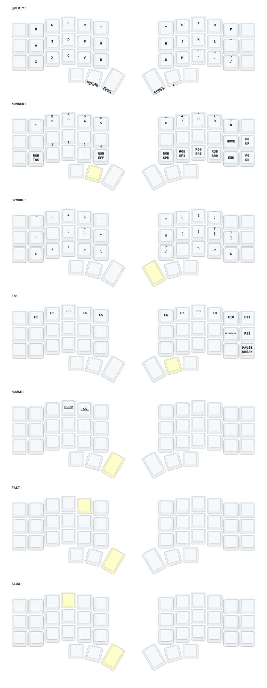

# ZMK Config: Corne

[](https://github.com/dedyoc/zmk-config/actions/workflows/build.yml)
[](https://github.com/zmkfirmware/zmk/releases/tag/v0.3.0)

[ZMK](https://zmk.dev) firmware configuration for a 42-key wireless split
[Corne](https://github.com/foostan/crkbd) (no OLED) on nRF52840 nice!nano v2 clones.



The diagram above is regenerated by CI on every keymap change and always
reflects the current `config/corne.keymap`.

## Contents

- [Features](#features)
- [Hardware](#hardware)
- [Layers](#layers)
- [Design notes](#design-notes)
- [Building](#building)
- [Flashing](#flashing)
- [Repository layout](#repository-layout)
- [Acknowledgements](#acknowledgements)

## Features

- **Timerless home-row mods.** GUI / Alt / Shift / Ctrl on both home rows,
  tuned so that fast typing never triggers a modifier or introduces latency.
- **Terminal-safe clipboard.** Dedicated paste, copy and cut keys that send
  `Shift+Insert`, `Ctrl+Insert` and `Shift+Delete`, so they work in terminals
  where `Ctrl+C` is SIGINT.
- **Mouse emulation** with cursor movement, scrolling, three buttons, and
  hold-to-modify speed keys (4x sprint, 1/4 precision).
- **Smooth scrolling** via HID resolution multipliers, where the host supports it.
- **Caps Word** on tap, Caps Lock on double tap.
- **RGB underglow**, off at boot, brightness capped at 80%, turns off when idle.
- **Battery reporting** for both halves through the central.
- **Pinned toolchain.** ZMK is locked to a tagged release, so upstream changes
  cannot break the build without a deliberate version bump.

## Hardware

| Component    | Part                                  |
|--------------|---------------------------------------|
| PCB          | Corne (crkbd), 6-column, 42 keys      |
| Controller   | nice!nano v2 clone (nRF52840), one per half. Built with the `nice_nano_v2` board target |
| Display      | None                                  |
| Lighting     | WS2812 underglow                      |
| Connectivity | Bluetooth LE, up to 4 host profiles   |

The left half acts as the split central.

## Layers

| # | Name   | Activation                  | Contents                                           |
|---|--------|-----------------------------|----------------------------------------------------|
| 0 | QWERTY | Default                     | Alphas, home-row mods, clipboard column            |
| 1 | NUMBER | Hold `Tab` (left thumb)     | Digits, arrows, navigation, Bluetooth, RGB         |
| 2 | SYMBOL | Hold `Enter` (right thumb)  | Programming symbols and brackets                   |
| 3 | Fn     | Hold `Backspace` (right thumb) | F1–F12, output toggle, BT clear, reset         |
| 4 | MOUSE  | Hold `Space` (left thumb)   | Cursor, scroll, mouse buttons, sticky mods         |
| 5 | FAST   | Hold `R` on MOUSE           | Signal layer: scales cursor 4x, scroll 3x          |
| 6 | SLOW   | Hold `E` on MOUSE           | Signal layer: scales cursor 1/4, scroll 1/3        |

Layers 5 and 6 are fully transparent. They exist only to activate
layer-scoped input processors on the pointer listeners, so the mouse layer
remains usable underneath while a speed key is held.

A detailed reference covering key positions, behavior parameters and tuning
guidance lives in [`docs/keymap-reference.md`](docs/keymap-reference.md).

## Design notes

Some choices in this keymap deviate from a stock Corne on purpose.

**Clipboard keys replace Tab, Esc and Shift on the outer left column.** The
`Insert`/`Delete` variants are understood by both GUI applications and
terminal emulators, which removes the need to remember two sets of shortcuts.

**Tab, Enter and Backspace live only on thumb layer-taps.** A layer-tap emits
its keycode on release, so these keys do not auto-repeat. Word deletion is
handled by `Ctrl+Backspace` instead.

**Home-row mods follow the timerless approach popularized by
[urob](https://github.com/urob/zmk-config).** The load-bearing setting is
`require-prior-idle-ms = 150`: any key pressed within 150 ms of the previous
one resolves as a tap immediately. Holds are only considered after a pause,
and `hold-trigger-key-positions` restricts them to opposite-hand keys.

| Symptom                     | Adjustment                     |
|-----------------------------|--------------------------------|
| Same-hand false modifiers   | Raise `tapping-term-ms`        |
| Cross-hand false modifiers  | Raise `require-prior-idle-ms`  |
| Missed modifiers when fast  | Lower `require-prior-idle-ms`  |

**No bootloader key.** Both inherited ones sat on the same hand as the thumb
that opens their layer, where they were too easy to hit mid-sentence. Enter
the bootloader with the double-tap reset button instead. The destructive keys
that remain (`BT_CLR`, `sys_reset`) are on the opposite hand from their layer
key, so a stray hit needs both hands.

## Building

Firmware is built by GitHub Actions using ZMK's reusable
`build-user-config.yml` workflow. Any push that touches `config/`,
`build.yaml` or the workflow itself starts a build.

1. Push a change, or trigger the workflow manually from the Actions tab.
2. Open the run and download the `firmware` artifact.
3. The archive contains `corne_left`, `corne_right` and `settings_reset`
   images in `.uf2` format.

The same workflow redraws `keymap-drawer/corne.svg` and commits it back as
`[Draw] <original message>`. Pull before making further commits.

### Local builds

For iterating on a build failure without a push per attempt,
`scripts/build.sh` builds in the official ZMK Docker image. The only host
requirement is Docker.

```sh
./scripts/build.sh            # both halves -> firmware/*.uf2
./scripts/build.sh left       # a single half
./scripts/build.sh --init     # recreate the west workspace
```

The first run initializes a west workspace at `~/zmk-workspace` (override
with `ZMK_WORKSPACE`) and takes several minutes. Subsequent builds are cached.

### Upgrading ZMK

ZMK is pinned to `v0.3.0`. Moving the pin is not a one-line change; the
following must be updated together:

| File                          | At `v0.3.0`             | On `main`                 |
|-------------------------------|-------------------------|---------------------------|
| `config/west.yml`             | `revision: v0.3.0`      | `revision: main`          |
| `.github/workflows/build.yml` | harness `@v0.3.0`       | harness `@main`           |
| `build.yaml`                  | `nice_nano_v2`          | `nice_nano/nrf52840/zmk`  |
| `scripts/build.sh`            | `nice_nano_v2`          | `nice_nano/nrf52840/zmk`  |
| `config/corne.conf`           | `CONFIG_WS2812_STRIP=y` | line removed              |

Kconfig warnings are fatal in this build, so an unrecognized `CONFIG_` symbol
fails CI rather than being ignored.

## Flashing

1. Connect one half over USB and double-tap its reset button. It mounts as a
   USB mass-storage device.
2. Copy the matching `.uf2` file onto the drive. The controller reboots
   automatically once the copy completes.
3. Repeat for the other half.

Both halves must be flashed whenever the keymap changes.

If the halves fail to pair with each other, flash `settings_reset` to both,
then reflash the normal firmware. This clears all stored Bluetooth bonds, so
hosts will need to be paired again.

## Repository layout

```
.
├── build.yaml                   CI build matrix
├── config/
│   ├── corne.keymap             Keymap (devicetree)
│   ├── corne.conf               Kconfig: RGB, sleep, pointing, BLE
│   ├── corne.json               Physical layout for ZMK Studio / keymap editors
│   └── west.yml                 West manifest, pins ZMK
├── docs/
│   └── keymap-reference.md      Positions, layers, behaviors, tuning
├── keymap-drawer/               Generated diagram (do not edit)
├── keymap_drawer.config.yaml    Diagram styling
└── scripts/
    └── build.sh                 Local Docker build
```

## Acknowledgements

- [ZMK Firmware](https://github.com/zmkfirmware/zmk)
- [foostan/crkbd](https://github.com/foostan/crkbd), the Corne keyboard
- [urob/zmk-config](https://github.com/urob/zmk-config), for the timerless home-row mod technique
- [caksoylar/keymap-drawer](https://github.com/caksoylar/keymap-drawer), for the generated diagram
- Forked from [a741725193/zmk-corne_no_display](https://github.com/a741725193/zmk-corne_no_display)
